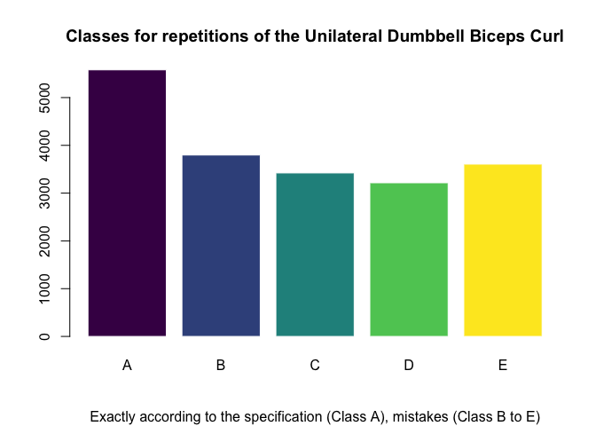
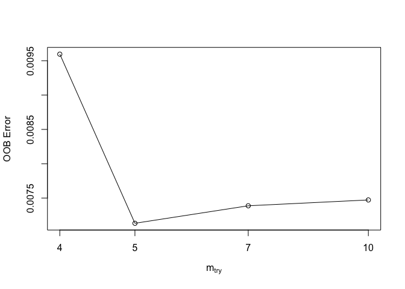
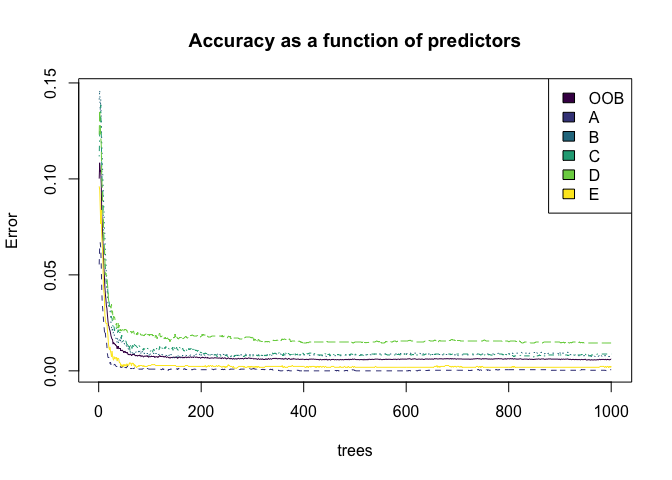
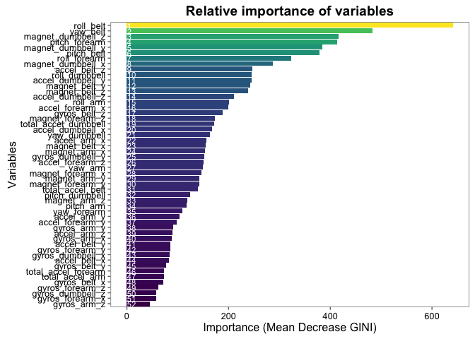
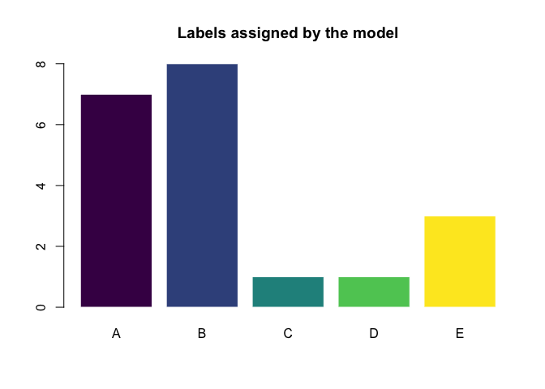

Machine Learning and Human Activity Recognition: Building a Classifier for Wearable Accelerometers’ Data
================
@jrcajide

[Human Activity Recognition](https://en.wikipedia.org/wiki/Activity_recognition) is a new and key research area in the last years and is gaining increasing attention by the pervasive computing research community.

Research on activity recognition has traditionally focused on discriminating between different activities, i.e. to predict "which" activity was performed at a specic point in time.

This analysis (based on [Qualitative Activity Recognition of Weight Lifting Exercises](http://groupware.les.inf.puc-rio.br/work.jsf?p1=11201), focuses in the **quality of executing an activity** and the results underline the potential of model-based assessment and the positive impact of real-time user feedback on the quality of execution.

The data, [Weight Lifting Exercises Dataset](http://groupware.les.inf.puc-rio.br/har) is about six young health participants that performed one set of 10 repetitions of the Unilateral Dumbbell Biceps Curl in five different fashions: exactly according to the specification (Class A), throwing the elbows to the front (Class B), lifting the dumbbell only halfway (Class C), lowering the dumbbell only halfway (Class D) and throwing the hips to the front (Class E).

**Random forest** was the machine learning model used to classify unlabeled data achieved from the 4 accelerometers in the test data set and predict the class of each repetition based 52 variables.

Although random forest implementation through the `caret` package got a great performance, the final model was tunned and run with the Breiman and Cutler's random forest approach implimented via the `randomForest` package achieving **99% accuracy** on its classification task.

1. Load training and testing data
=================================

Data importing and wrangling tasks were performed used `data.table` library.

`Empty/NaN/NA/#DIV/0!` values found in the original data set were labeled as *missing data*.

``` r
rm(list = ls());gc(reset = T)
```

    ##          used (Mb) gc trigger (Mb) max used (Mb)
    ## Ncells 374058 20.0     592000 31.7   374058 20.0
    ## Vcells 575359  4.4    1308461 10.0   575359  4.4

``` r
set.seed(1973)

# loading libraries -------------------------------------------------------
library(data.table)
library(dplyr)
```

    ## Warning: package 'dplyr' was built under R version 3.2.5

    ## -------------------------------------------------------------------------

    ## data.table + dplyr code now lives in dtplyr.
    ## Please library(dtplyr)!

    ## -------------------------------------------------------------------------

    ## 
    ## Attaching package: 'dplyr'

    ## The following objects are masked from 'package:data.table':
    ## 
    ##     between, first, last

    ## The following objects are masked from 'package:stats':
    ## 
    ##     filter, lag

    ## The following objects are masked from 'package:base':
    ## 
    ##     intersect, setdiff, setequal, union

``` r
library(knitr)
```

    ## Warning: package 'knitr' was built under R version 3.2.5

``` r
library(randomForest)
```

    ## randomForest 4.6-12

    ## Type rfNews() to see new features/changes/bug fixes.

    ## 
    ## Attaching package: 'randomForest'

    ## The following object is masked from 'package:dplyr':
    ## 
    ##     combine

``` r
library(caret)
```

    ## Loading required package: lattice

    ## Loading required package: ggplot2

    ## 
    ## Attaching package: 'ggplot2'

    ## The following object is masked from 'package:randomForest':
    ## 
    ##     margin

``` r
library(ggplot2)
library(ggthemes)
library(viridis)

# importing data ----------------------------------------------------------

DT.train <- fread("https://d396qusza40orc.cloudfront.net/predmachlearn/pml-training.csv", stringsAsFactors = F, drop = 'V1', na.strings = c('','#DIV/0!','NA'))
DT.test <- fread("https://d396qusza40orc.cloudfront.net/predmachlearn/pml-testing.csv", stringsAsFactors = F, drop = 'V1', na.strings = c('','#DIV/0!','NA'))
```

2. Exploratory data analysis
============================

Missing values
--------------

Many of the variables have a high percentage of missing values.

``` r
str(DT.train)
```

    ## Classes 'data.table' and 'data.frame':   19622 obs. of  159 variables:
    ##  $ user_name               : chr  "carlitos" "carlitos" "carlitos" "carlitos" ...
    ##  $ raw_timestamp_part_1    : int  1323084231 1323084231 1323084231 1323084232 1323084232 1323084232 1323084232 1323084232 1323084232 1323084232 ...
    ##  $ raw_timestamp_part_2    : int  788290 808298 820366 120339 196328 304277 368296 440390 484323 484434 ...
    ##  $ cvtd_timestamp          : chr  "05/12/2011 11:23" "05/12/2011 11:23" "05/12/2011 11:23" "05/12/2011 11:23" ...
    ##  $ new_window              : chr  "no" "no" "no" "no" ...
    ##  $ num_window              : int  11 11 11 12 12 12 12 12 12 12 ...
    ##  $ roll_belt               : num  1.41 1.41 1.42 1.48 1.48 1.45 1.42 1.42 1.43 1.45 ...
    ##  $ pitch_belt              : num  8.07 8.07 8.07 8.05 8.07 8.06 8.09 8.13 8.16 8.17 ...
    ##  $ yaw_belt                : num  -94.4 -94.4 -94.4 -94.4 -94.4 -94.4 -94.4 -94.4 -94.4 -94.4 ...
    ##  $ total_accel_belt        : int  3 3 3 3 3 3 3 3 3 3 ...
    ##  $ kurtosis_roll_belt      : chr  NA NA NA NA ...
    ##  $ kurtosis_picth_belt     : chr  NA NA NA NA ...
    ##  $ kurtosis_yaw_belt       : chr  NA NA NA NA ...
    ##  $ skewness_roll_belt      : chr  NA NA NA NA ...
    ##  $ skewness_roll_belt.1    : chr  NA NA NA NA ...
    ##  $ skewness_yaw_belt       : chr  NA NA NA NA ...
    ##  $ max_roll_belt           : num  NA NA NA NA NA NA NA NA NA NA ...
    ##  $ max_picth_belt          : int  NA NA NA NA NA NA NA NA NA NA ...
    ##  $ max_yaw_belt            : chr  NA NA NA NA ...
    ##  $ min_roll_belt           : num  NA NA NA NA NA NA NA NA NA NA ...
    ##  $ min_pitch_belt          : int  NA NA NA NA NA NA NA NA NA NA ...
    ##  $ min_yaw_belt            : chr  NA NA NA NA ...
    ##  $ amplitude_roll_belt     : num  NA NA NA NA NA NA NA NA NA NA ...
    ##  $ amplitude_pitch_belt    : int  NA NA NA NA NA NA NA NA NA NA ...
    ##  $ amplitude_yaw_belt      : chr  NA NA NA NA ...
    ##  $ var_total_accel_belt    : num  NA NA NA NA NA NA NA NA NA NA ...
    ##  $ avg_roll_belt           : num  NA NA NA NA NA NA NA NA NA NA ...
    ##  $ stddev_roll_belt        : num  NA NA NA NA NA NA NA NA NA NA ...
    ##  $ var_roll_belt           : num  NA NA NA NA NA NA NA NA NA NA ...
    ##  $ avg_pitch_belt          : num  NA NA NA NA NA NA NA NA NA NA ...
    ##  $ stddev_pitch_belt       : num  NA NA NA NA NA NA NA NA NA NA ...
    ##  $ var_pitch_belt          : num  NA NA NA NA NA NA NA NA NA NA ...
    ##  $ avg_yaw_belt            : num  NA NA NA NA NA NA NA NA NA NA ...
    ##  $ stddev_yaw_belt         : num  NA NA NA NA NA NA NA NA NA NA ...
    ##  $ var_yaw_belt            : num  NA NA NA NA NA NA NA NA NA NA ...
    ##  $ gyros_belt_x            : num  0 0.02 0 0.02 0.02 0.02 0.02 0.02 0.02 0.03 ...
    ##  $ gyros_belt_y            : num  0 0 0 0 0.02 0 0 0 0 0 ...
    ##  $ gyros_belt_z            : num  -0.02 -0.02 -0.02 -0.03 -0.02 -0.02 -0.02 -0.02 -0.02 0 ...
    ##  $ accel_belt_x            : int  -21 -22 -20 -22 -21 -21 -22 -22 -20 -21 ...
    ##  $ accel_belt_y            : int  4 4 5 3 2 4 3 4 2 4 ...
    ##  $ accel_belt_z            : int  22 22 23 21 24 21 21 21 24 22 ...
    ##  $ magnet_belt_x           : int  -3 -7 -2 -6 -6 0 -4 -2 1 -3 ...
    ##  $ magnet_belt_y           : int  599 608 600 604 600 603 599 603 602 609 ...
    ##  $ magnet_belt_z           : int  -313 -311 -305 -310 -302 -312 -311 -313 -312 -308 ...
    ##  $ roll_arm                : num  -128 -128 -128 -128 -128 -128 -128 -128 -128 -128 ...
    ##  $ pitch_arm               : num  22.5 22.5 22.5 22.1 22.1 22 21.9 21.8 21.7 21.6 ...
    ##  $ yaw_arm                 : num  -161 -161 -161 -161 -161 -161 -161 -161 -161 -161 ...
    ##  $ total_accel_arm         : int  34 34 34 34 34 34 34 34 34 34 ...
    ##  $ var_accel_arm           : num  NA NA NA NA NA NA NA NA NA NA ...
    ##  $ avg_roll_arm            : num  NA NA NA NA NA NA NA NA NA NA ...
    ##  $ stddev_roll_arm         : num  NA NA NA NA NA NA NA NA NA NA ...
    ##  $ var_roll_arm            : num  NA NA NA NA NA NA NA NA NA NA ...
    ##  $ avg_pitch_arm           : num  NA NA NA NA NA NA NA NA NA NA ...
    ##  $ stddev_pitch_arm        : num  NA NA NA NA NA NA NA NA NA NA ...
    ##  $ var_pitch_arm           : num  NA NA NA NA NA NA NA NA NA NA ...
    ##  $ avg_yaw_arm             : num  NA NA NA NA NA NA NA NA NA NA ...
    ##  $ stddev_yaw_arm          : num  NA NA NA NA NA NA NA NA NA NA ...
    ##  $ var_yaw_arm             : num  NA NA NA NA NA NA NA NA NA NA ...
    ##  $ gyros_arm_x             : num  0 0.02 0.02 0.02 0 0.02 0 0.02 0.02 0.02 ...
    ##  $ gyros_arm_y             : num  0 -0.02 -0.02 -0.03 -0.03 -0.03 -0.03 -0.02 -0.03 -0.03 ...
    ##  $ gyros_arm_z             : num  -0.02 -0.02 -0.02 0.02 0 0 0 0 -0.02 -0.02 ...
    ##  $ accel_arm_x             : int  -288 -290 -289 -289 -289 -289 -289 -289 -288 -288 ...
    ##  $ accel_arm_y             : int  109 110 110 111 111 111 111 111 109 110 ...
    ##  $ accel_arm_z             : int  -123 -125 -126 -123 -123 -122 -125 -124 -122 -124 ...
    ##  $ magnet_arm_x            : int  -368 -369 -368 -372 -374 -369 -373 -372 -369 -376 ...
    ##  $ magnet_arm_y            : int  337 337 344 344 337 342 336 338 341 334 ...
    ##  $ magnet_arm_z            : int  516 513 513 512 506 513 509 510 518 516 ...
    ##  $ kurtosis_roll_arm       : chr  NA NA NA NA ...
    ##  $ kurtosis_picth_arm      : chr  NA NA NA NA ...
    ##  $ kurtosis_yaw_arm        : chr  NA NA NA NA ...
    ##  $ skewness_roll_arm       : chr  NA NA NA NA ...
    ##  $ skewness_pitch_arm      : chr  NA NA NA NA ...
    ##  $ skewness_yaw_arm        : chr  NA NA NA NA ...
    ##  $ max_roll_arm            : num  NA NA NA NA NA NA NA NA NA NA ...
    ##  $ max_picth_arm           : num  NA NA NA NA NA NA NA NA NA NA ...
    ##  $ max_yaw_arm             : int  NA NA NA NA NA NA NA NA NA NA ...
    ##  $ min_roll_arm            : num  NA NA NA NA NA NA NA NA NA NA ...
    ##  $ min_pitch_arm           : num  NA NA NA NA NA NA NA NA NA NA ...
    ##  $ min_yaw_arm             : int  NA NA NA NA NA NA NA NA NA NA ...
    ##  $ amplitude_roll_arm      : num  NA NA NA NA NA NA NA NA NA NA ...
    ##  $ amplitude_pitch_arm     : num  NA NA NA NA NA NA NA NA NA NA ...
    ##  $ amplitude_yaw_arm       : int  NA NA NA NA NA NA NA NA NA NA ...
    ##  $ roll_dumbbell           : num  13.1 13.1 12.9 13.4 13.4 ...
    ##  $ pitch_dumbbell          : num  -70.5 -70.6 -70.3 -70.4 -70.4 ...
    ##  $ yaw_dumbbell            : num  -84.9 -84.7 -85.1 -84.9 -84.9 ...
    ##  $ kurtosis_roll_dumbbell  : chr  NA NA NA NA ...
    ##  $ kurtosis_picth_dumbbell : chr  NA NA NA NA ...
    ##  $ kurtosis_yaw_dumbbell   : chr  NA NA NA NA ...
    ##  $ skewness_roll_dumbbell  : chr  NA NA NA NA ...
    ##  $ skewness_pitch_dumbbell : chr  NA NA NA NA ...
    ##  $ skewness_yaw_dumbbell   : chr  NA NA NA NA ...
    ##  $ max_roll_dumbbell       : num  NA NA NA NA NA NA NA NA NA NA ...
    ##  $ max_picth_dumbbell      : num  NA NA NA NA NA NA NA NA NA NA ...
    ##  $ max_yaw_dumbbell        : chr  NA NA NA NA ...
    ##  $ min_roll_dumbbell       : num  NA NA NA NA NA NA NA NA NA NA ...
    ##  $ min_pitch_dumbbell      : num  NA NA NA NA NA NA NA NA NA NA ...
    ##  $ min_yaw_dumbbell        : chr  NA NA NA NA ...
    ##  $ amplitude_roll_dumbbell : num  NA NA NA NA NA NA NA NA NA NA ...
    ##  $ amplitude_pitch_dumbbell: num  NA NA NA NA NA NA NA NA NA NA ...
    ##   [list output truncated]
    ##  - attr(*, ".internal.selfref")=<externalptr>

There are several variables that contain approximately 97.93% missing values.

``` r
# missing values ----------------------------------------------------------
# Percentagg of missing values by variable:
sapply(DT.train, function(x) sum(is.na(x)) / nrow(DT.train) )
```

    ##                user_name     raw_timestamp_part_1     raw_timestamp_part_2 
    ##                0.0000000                0.0000000                0.0000000 
    ##           cvtd_timestamp               new_window               num_window 
    ##                0.0000000                0.0000000                0.0000000 
    ##                roll_belt               pitch_belt                 yaw_belt 
    ##                0.0000000                0.0000000                0.0000000 
    ##         total_accel_belt       kurtosis_roll_belt      kurtosis_picth_belt 
    ##                0.0000000                0.9798186                0.9809398 
    ##        kurtosis_yaw_belt       skewness_roll_belt     skewness_roll_belt.1 
    ##                1.0000000                0.9797676                0.9809398 
    ##        skewness_yaw_belt            max_roll_belt           max_picth_belt 
    ##                1.0000000                0.9793089                0.9793089 
    ##             max_yaw_belt            min_roll_belt           min_pitch_belt 
    ##                0.9798186                0.9793089                0.9793089 
    ##             min_yaw_belt      amplitude_roll_belt     amplitude_pitch_belt 
    ##                0.9798186                0.9793089                0.9793089 
    ##       amplitude_yaw_belt     var_total_accel_belt            avg_roll_belt 
    ##                0.9798186                0.9793089                0.9793089 
    ##         stddev_roll_belt            var_roll_belt           avg_pitch_belt 
    ##                0.9793089                0.9793089                0.9793089 
    ##        stddev_pitch_belt           var_pitch_belt             avg_yaw_belt 
    ##                0.9793089                0.9793089                0.9793089 
    ##          stddev_yaw_belt             var_yaw_belt             gyros_belt_x 
    ##                0.9793089                0.9793089                0.0000000 
    ##             gyros_belt_y             gyros_belt_z             accel_belt_x 
    ##                0.0000000                0.0000000                0.0000000 
    ##             accel_belt_y             accel_belt_z            magnet_belt_x 
    ##                0.0000000                0.0000000                0.0000000 
    ##            magnet_belt_y            magnet_belt_z                 roll_arm 
    ##                0.0000000                0.0000000                0.0000000 
    ##                pitch_arm                  yaw_arm          total_accel_arm 
    ##                0.0000000                0.0000000                0.0000000 
    ##            var_accel_arm             avg_roll_arm          stddev_roll_arm 
    ##                0.9793089                0.9793089                0.9793089 
    ##             var_roll_arm            avg_pitch_arm         stddev_pitch_arm 
    ##                0.9793089                0.9793089                0.9793089 
    ##            var_pitch_arm              avg_yaw_arm           stddev_yaw_arm 
    ##                0.9793089                0.9793089                0.9793089 
    ##              var_yaw_arm              gyros_arm_x              gyros_arm_y 
    ##                0.9793089                0.0000000                0.0000000 
    ##              gyros_arm_z              accel_arm_x              accel_arm_y 
    ##                0.0000000                0.0000000                0.0000000 
    ##              accel_arm_z             magnet_arm_x             magnet_arm_y 
    ##                0.0000000                0.0000000                0.0000000 
    ##             magnet_arm_z        kurtosis_roll_arm       kurtosis_picth_arm 
    ##                0.0000000                0.9832841                0.9833860 
    ##         kurtosis_yaw_arm        skewness_roll_arm       skewness_pitch_arm 
    ##                0.9798695                0.9832331                0.9833860 
    ##         skewness_yaw_arm             max_roll_arm            max_picth_arm 
    ##                0.9798695                0.9793089                0.9793089 
    ##              max_yaw_arm             min_roll_arm            min_pitch_arm 
    ##                0.9793089                0.9793089                0.9793089 
    ##              min_yaw_arm       amplitude_roll_arm      amplitude_pitch_arm 
    ##                0.9793089                0.9793089                0.9793089 
    ##        amplitude_yaw_arm            roll_dumbbell           pitch_dumbbell 
    ##                0.9793089                0.0000000                0.0000000 
    ##             yaw_dumbbell   kurtosis_roll_dumbbell  kurtosis_picth_dumbbell 
    ##                0.0000000                0.9795638                0.9794109 
    ##    kurtosis_yaw_dumbbell   skewness_roll_dumbbell  skewness_pitch_dumbbell 
    ##                1.0000000                0.9795128                0.9793599 
    ##    skewness_yaw_dumbbell        max_roll_dumbbell       max_picth_dumbbell 
    ##                1.0000000                0.9793089                0.9793089 
    ##         max_yaw_dumbbell        min_roll_dumbbell       min_pitch_dumbbell 
    ##                0.9795638                0.9793089                0.9793089 
    ##         min_yaw_dumbbell  amplitude_roll_dumbbell amplitude_pitch_dumbbell 
    ##                0.9795638                0.9793089                0.9793089 
    ##   amplitude_yaw_dumbbell     total_accel_dumbbell       var_accel_dumbbell 
    ##                0.9795638                0.0000000                0.9793089 
    ##        avg_roll_dumbbell     stddev_roll_dumbbell        var_roll_dumbbell 
    ##                0.9793089                0.9793089                0.9793089 
    ##       avg_pitch_dumbbell    stddev_pitch_dumbbell       var_pitch_dumbbell 
    ##                0.9793089                0.9793089                0.9793089 
    ##         avg_yaw_dumbbell      stddev_yaw_dumbbell         var_yaw_dumbbell 
    ##                0.9793089                0.9793089                0.9793089 
    ##         gyros_dumbbell_x         gyros_dumbbell_y         gyros_dumbbell_z 
    ##                0.0000000                0.0000000                0.0000000 
    ##         accel_dumbbell_x         accel_dumbbell_y         accel_dumbbell_z 
    ##                0.0000000                0.0000000                0.0000000 
    ##        magnet_dumbbell_x        magnet_dumbbell_y        magnet_dumbbell_z 
    ##                0.0000000                0.0000000                0.0000000 
    ##             roll_forearm            pitch_forearm              yaw_forearm 
    ##                0.0000000                0.0000000                0.0000000 
    ##    kurtosis_roll_forearm   kurtosis_picth_forearm     kurtosis_yaw_forearm 
    ##                0.9835898                0.9836408                1.0000000 
    ##    skewness_roll_forearm   skewness_pitch_forearm     skewness_yaw_forearm 
    ##                0.9835389                0.9836408                1.0000000 
    ##         max_roll_forearm        max_picth_forearm          max_yaw_forearm 
    ##                0.9793089                0.9793089                0.9835898 
    ##         min_roll_forearm        min_pitch_forearm          min_yaw_forearm 
    ##                0.9793089                0.9793089                0.9835898 
    ##   amplitude_roll_forearm  amplitude_pitch_forearm    amplitude_yaw_forearm 
    ##                0.9793089                0.9793089                0.9835898 
    ##      total_accel_forearm        var_accel_forearm         avg_roll_forearm 
    ##                0.0000000                0.9793089                0.9793089 
    ##      stddev_roll_forearm         var_roll_forearm        avg_pitch_forearm 
    ##                0.9793089                0.9793089                0.9793089 
    ##     stddev_pitch_forearm        var_pitch_forearm          avg_yaw_forearm 
    ##                0.9793089                0.9793089                0.9793089 
    ##       stddev_yaw_forearm          var_yaw_forearm          gyros_forearm_x 
    ##                0.9793089                0.9793089                0.0000000 
    ##          gyros_forearm_y          gyros_forearm_z          accel_forearm_x 
    ##                0.0000000                0.0000000                0.0000000 
    ##          accel_forearm_y          accel_forearm_z         magnet_forearm_x 
    ##                0.0000000                0.0000000                0.0000000 
    ##         magnet_forearm_y         magnet_forearm_z                   classe 
    ##                0.0000000                0.0000000                0.0000000

Those variables were removed from the data sets:

``` r
DT.train <- DT.train[, .SD, .SDcols=sapply(DT.train, function(x) (sum(is.na(x))) / nrow(DT.train)) < 0.9793089  ]
DT.test <- DT.test[, .SD, .SDcols=sapply(DT.test, function(x) (sum(is.na(x))) / nrow(DT.test)) < 0.9793089  ]
```

Only common variables in both training and testing data sets, related to the belt, forearm, arm and dumbell, are needed to predict the `classe` variable:

``` r
DT.train <- DT.train[, grep("classe|belt|arm|dumbbell",names(DT.train)), with=F]
DT.train <- DT.train[, which((names(DT.train) %in% names(DT.test)) | names(DT.train)=="classe"), with=F]
DT.train <- DT.train[, classe := as.factor(classe)]
DT.train[]
```

    ##        roll_belt pitch_belt yaw_belt total_accel_belt gyros_belt_x
    ##     1:      1.41       8.07    -94.4                3         0.00
    ##     2:      1.41       8.07    -94.4                3         0.02
    ##     3:      1.42       8.07    -94.4                3         0.00
    ##     4:      1.48       8.05    -94.4                3         0.02
    ##     5:      1.48       8.07    -94.4                3         0.02
    ##    ---                                                            
    ## 19618:    147.00     -34.80    129.0               21         0.37
    ## 19619:    145.00     -35.30    130.0               19         0.39
    ## 19620:    145.00     -35.50    130.0               19         0.37
    ## 19621:    143.00     -35.90    131.0               18         0.37
    ## 19622:    143.00     -36.00    132.0               18         0.35
    ##        gyros_belt_y gyros_belt_z accel_belt_x accel_belt_y accel_belt_z
    ##     1:         0.00        -0.02          -21            4           22
    ##     2:         0.00        -0.02          -22            4           22
    ##     3:         0.00        -0.02          -20            5           23
    ##     4:         0.00        -0.03          -22            3           21
    ##     5:         0.02        -0.02          -21            2           24
    ##    ---                                                                 
    ## 19618:        -0.02        -0.67           50           26         -193
    ## 19619:        -0.02        -0.67           47           15         -179
    ## 19620:         0.00        -0.64           47           13         -177
    ## 19621:        -0.02        -0.59           46           18         -172
    ## 19622:        -0.02        -0.57           42           25         -171
    ##        magnet_belt_x magnet_belt_y magnet_belt_z roll_arm pitch_arm
    ##     1:            -3           599          -313   -128.0      22.5
    ##     2:            -7           608          -311   -128.0      22.5
    ##     3:            -2           600          -305   -128.0      22.5
    ##     4:            -6           604          -310   -128.0      22.1
    ##     5:            -6           600          -302   -128.0      22.1
    ##    ---                                                             
    ## 19618:           190           552          -412    -99.4     -33.8
    ## 19619:           192           558          -389    -99.6     -34.5
    ## 19620:           191           560          -386    -99.6     -35.1
    ## 19621:           190           565          -370    -98.6     -36.7
    ## 19622:           194           566          -349    -97.6     -37.7
    ##        yaw_arm total_accel_arm gyros_arm_x gyros_arm_y gyros_arm_z
    ##     1:  -161.0              34        0.00        0.00       -0.02
    ##     2:  -161.0              34        0.02       -0.02       -0.02
    ##     3:  -161.0              34        0.02       -0.02       -0.02
    ##     4:  -161.0              34        0.02       -0.03        0.02
    ##     5:  -161.0              34        0.00       -0.03        0.00
    ##    ---                                                            
    ## 19618:    79.0              47        0.55       -0.51        0.25
    ## 19619:    77.3              45        0.88       -0.71        0.21
    ## 19620:    76.3              44        0.98       -0.82        0.23
    ## 19621:    73.5              41        1.35       -1.00        0.49
    ## 19622:    71.5              41        1.51       -1.06        0.59
    ##        accel_arm_x accel_arm_y accel_arm_z magnet_arm_x magnet_arm_y
    ##     1:        -288         109        -123         -368          337
    ##     2:        -290         110        -125         -369          337
    ##     3:        -289         110        -126         -368          344
    ##     4:        -289         111        -123         -372          344
    ##     5:        -289         111        -123         -374          337
    ##    ---                                                              
    ## 19618:          75        -184        -415          272         -134
    ## 19619:          52        -163        -406          288         -112
    ## 19620:          62        -167        -391          309         -103
    ## 19621:          70        -164        -359          339          -91
    ## 19622:          58        -152        -365          362          -84
    ##        magnet_arm_z roll_dumbbell pitch_dumbbell yaw_dumbbell
    ##     1:          516      13.05217      -70.49400    -84.87394
    ##     2:          513      13.13074      -70.63751    -84.71065
    ##     3:          513      12.85075      -70.27812    -85.14078
    ##     4:          512      13.43120      -70.39379    -84.87363
    ##     5:          506      13.37872      -70.42856    -84.85306
    ##    ---                                                       
    ## 19618:         -562      36.41318      -22.86197   -113.49983
    ## 19619:         -559      35.15281      -22.97191   -114.52564
    ## 19620:         -541      30.06028      -20.99018   -120.03180
    ## 19621:         -543      22.86333      -21.75662   -125.24587
    ## 19622:         -539      20.80000      -19.70000   -128.20000
    ##        total_accel_dumbbell gyros_dumbbell_x gyros_dumbbell_y
    ##     1:                   37             0.00            -0.02
    ##     2:                   37             0.00            -0.02
    ##     3:                   37             0.00            -0.02
    ##     4:                   37             0.00            -0.02
    ##     5:                   37             0.00            -0.02
    ##    ---                                                       
    ## 19618:                   19             0.32            -0.26
    ## 19619:                   18             0.24            -0.24
    ## 19620:                   19             0.22            -0.27
    ## 19621:                   19             0.13            -0.14
    ## 19622:                   19             0.02             0.02
    ##        gyros_dumbbell_z accel_dumbbell_x accel_dumbbell_y accel_dumbbell_z
    ##     1:             0.00             -234               47             -271
    ##     2:             0.00             -233               47             -269
    ##     3:             0.00             -232               46             -270
    ##     4:            -0.02             -232               48             -269
    ##     5:             0.00             -233               48             -270
    ##    ---                                                                    
    ## 19618:            -0.36              -42               66             -168
    ## 19619:             0.05              -41               62             -164
    ## 19620:             0.21              -38               54             -170
    ## 19621:             0.34              -40               42             -176
    ## 19622:             0.36              -36               38             -176
    ##        magnet_dumbbell_x magnet_dumbbell_y magnet_dumbbell_z roll_forearm
    ##     1:              -559               293               -65         28.4
    ##     2:              -555               296               -64         28.3
    ##     3:              -561               298               -63         28.3
    ##     4:              -552               303               -60         28.1
    ##     5:              -554               292               -68         28.0
    ##    ---                                                                   
    ## 19618:              -618               134                 0          0.0
    ## 19619:              -618               116                 7          0.0
    ## 19620:              -621               113                -9          0.0
    ## 19621:              -628               116                 0          0.0
    ## 19622:              -627               119                 2          0.0
    ##        pitch_forearm yaw_forearm total_accel_forearm gyros_forearm_x
    ##     1:         -63.9        -153                  36            0.03
    ##     2:         -63.9        -153                  36            0.02
    ##     3:         -63.9        -152                  36            0.03
    ##     4:         -63.9        -152                  36            0.02
    ##     5:         -63.9        -152                  36            0.02
    ##    ---                                                              
    ## 19618:           0.0           0                  29            1.73
    ## 19619:           0.0           0                  29            1.59
    ## 19620:           0.0           0                  29            1.54
    ## 19621:           0.0           0                  32            1.48
    ## 19622:           0.0           0                  33            1.38
    ##        gyros_forearm_y gyros_forearm_z accel_forearm_x accel_forearm_y
    ##     1:            0.00           -0.02             192             203
    ##     2:            0.00           -0.02             192             203
    ##     3:           -0.02            0.00             196             204
    ##     4:           -0.02            0.00             189             206
    ##     5:            0.00           -0.02             189             206
    ##    ---                                                                
    ## 19618:           -1.75           -0.25            -271             -68
    ## 19619:           -1.36            0.00            -271             -91
    ## 19620:           -1.20            0.05            -263             -99
    ## 19621:           -0.90            0.05            -270            -141
    ## 19622:           -0.64            0.08            -278            -159
    ##        accel_forearm_z magnet_forearm_x magnet_forearm_y magnet_forearm_z
    ##     1:            -215              -17              654              476
    ##     2:            -216              -18              661              473
    ##     3:            -213              -18              658              469
    ##     4:            -214              -16              658              469
    ##     5:            -214              -17              655              473
    ##    ---                                                                   
    ## 19618:             -37             -205             -587                6
    ## 19619:             -43             -151             -635              -36
    ## 19620:             -45             -116             -654              -70
    ## 19621:             -51              -68             -678              -98
    ## 19622:             -52              -60             -686             -110
    ##        classe
    ##     1:      A
    ##     2:      A
    ##     3:      A
    ##     4:      A
    ##     5:      A
    ##    ---       
    ## 19618:      E
    ## 19619:      E
    ## 19620:      E
    ## 19621:      E
    ## 19622:      E

Classes
-------

Simply barplot showing the frequency of each class in the training data set:

``` r
barplot(table(DT.train$classe),col=viridis(5), border = "white", main="Classes for repetitions of the Unilateral Dumbbell Biceps Curl", sub="Exactly according to the specification (Class A), mistakes (Class B to E)")
```



3. Cross validation
===================

Cross validation is a technique for assessing how the results of a statistical analysis will generalize to an independent data set.

Training data set was splited into validation and train data. The `createDataPartition` in the `caret` package was used for this task.

``` r
# Cross validation
inTrain <- createDataPartition(y = DT.train$classe, p = 0.6, list = FALSE)
DT.validation <- DT.train[-inTrain, ]
DT.train <- DT.train[inTrain, ] 
```

4. Modelling
============

The random forests technique examines a large ensemble of decision trees, by first generating a random sample of the original data with replacement (bootstrapping).

4.1. Model tunning
------------------

`tuneRF` searches for optimal mtry values (with respect to Out-of-Bag error estimate) given the data, that is, the number of variable per level split.

``` r
bestmtry <- tuneRF(DT.train[,-ncol(DT.train), with=F], DT.train$classe, ntreeTry=100, stepFactor=1.5, improve=0.01, trace=TRUE, plot=TRUE, dobest=FALSE)
```

    ## mtry = 7  OOB error = 0.74% 
    ## Searching left ...
    ## mtry = 5     OOB error = 0.71% 
    ## 0.03448276 0.01 
    ## mtry = 4     OOB error = 0.96% 
    ## -0.3452381 0.01 
    ## Searching right ...
    ## mtry = 10    OOB error = 0.75% 
    ## -0.04761905 0.01



4.2. Generating the classification model
----------------------------------------

A Random forest model was generated with the training data and validated with the validation data.

``` r
bestmtry <- bestmtry[bestmtry[, 2] == min(bestmtry[, 2]), 1]
rf <- randomForest(classe ~ . , data=DT.train, mtry=bestmtry, ntree=1000, keep.forest=TRUE, importance=TRUE, test=DT.validation)
print(rf)
```

    ## 
    ## Call:
    ##  randomForest(formula = classe ~ ., data = DT.train, mtry = bestmtry,      ntree = 1000, keep.forest = TRUE, importance = TRUE, test = DT.validation) 
    ##                Type of random forest: classification
    ##                      Number of trees: 1000
    ## No. of variables tried at each split: 5
    ## 
    ##         OOB estimate of  error rate: 0.61%
    ## Confusion matrix:
    ##      A    B    C    D    E  class.error
    ## A 3346    1    1    0    0 0.0005973716
    ## B   13 2260    6    0    0 0.0083369899
    ## C    0   15 2036    3    0 0.0087633885
    ## D    0    0   25 1902    3 0.0145077720
    ## E    0    0    1    4 2160 0.0023094688

4.3. Assessing model accuracy
=============================

Checking model accuracy over the validation data set shows that **the model is able to classify correctly more than 99% of the observations**.

``` r
prediction <- predict(rf, DT.validation)
confusionMatrix(prediction, DT.validation$classe)
```

    ## Confusion Matrix and Statistics
    ## 
    ##           Reference
    ## Prediction    A    B    C    D    E
    ##          A 2230   10    0    0    0
    ##          B    2 1507   13    0    0
    ##          C    0    1 1353   19    0
    ##          D    0    0    2 1266    7
    ##          E    0    0    0    1 1435
    ## 
    ## Overall Statistics
    ##                                           
    ##                Accuracy : 0.993           
    ##                  95% CI : (0.9909, 0.9947)
    ##     No Information Rate : 0.2845          
    ##     P-Value [Acc > NIR] : < 2.2e-16       
    ##                                           
    ##                   Kappa : 0.9911          
    ##  Mcnemar's Test P-Value : NA              
    ## 
    ## Statistics by Class:
    ## 
    ##                      Class: A Class: B Class: C Class: D Class: E
    ## Sensitivity            0.9991   0.9928   0.9890   0.9844   0.9951
    ## Specificity            0.9982   0.9976   0.9969   0.9986   0.9998
    ## Pos Pred Value         0.9955   0.9901   0.9854   0.9929   0.9993
    ## Neg Pred Value         0.9996   0.9983   0.9977   0.9970   0.9989
    ## Prevalence             0.2845   0.1935   0.1744   0.1639   0.1838
    ## Detection Rate         0.2842   0.1921   0.1724   0.1614   0.1829
    ## Detection Prevalence   0.2855   0.1940   0.1750   0.1625   0.1830
    ## Balanced Accuracy      0.9987   0.9952   0.9930   0.9915   0.9975

``` r
# Show model error
plot(rf, main = "Accuracy as a function of predictors", col=viridis(6))
legend('topright', colnames(rf$err.rate), col=viridis(6), fill=viridis(6))
```



The dark line shows the overall error rate which falls below 0.65%. The other lines shows the error rates for each class classification.

4.4. Relative variable importance.
----------------------------------

-   Plotting the mean decrease in Gini calculated across all trees \*

For each variable in the data set, it tells how important that variable is in classifying the data.

The plot shows each variable on the y-axis, and their importance on the x-axis. They are ordered top-to-bottom as most important. to least important. Therefore, the most important variables are at the top and an estimate of their importance is given by the value on the x-axis.

``` r
# 4.3 Variable importance

# Let’s look at relative variable importance by plotting the mean decrease in Gini calculated across all trees.

# Get importance
importance    <- importance(rf)
varImportance <- data.table(variables = row.names(importance), 
                            importance = round(importance[ ,'MeanDecreaseGini'],2))

varImportance <- varImportance[, Rank := min_rank(desc(importance))][order((Rank)),]
# Use ggplot2 to visualize the relative importance of variables
ggplot(varImportance, aes(x = reorder(variables, importance), y = importance, fill = importance)) +
  geom_bar(stat='identity') + 
  geom_text(aes(x = variables, y = 0.5, label = Rank), hjust=0, vjust=0.55, size = 3, colour = 'white') +
  labs(x = 'Variables', y = 'Importance (Mean Decrease GINI)') +
  scale_fill_viridis(discrete=F) +
  coord_flip() + 
  theme_few() +
  ggtitle("Relative importance of variables") + 
  theme(plot.title = element_text(lineheight=.8, face="bold"), legend.position="none") 
```



-   GINI importance measures the average gain of purity by splits of a given variable. \*

5. Predict
==========

Predicting the classes of the 20 observations from the test data set.

``` r
# Predict using the test set
prediction <- predict(rf, DT.test)
prediction
```

    ##  1  2  3  4  5  6  7  8  9 10 11 12 13 14 15 16 17 18 19 20 
    ##  B  A  B  A  A  E  D  B  A  A  B  C  B  A  E  E  A  B  B  B 
    ## Levels: A B C D E

``` r
# Save the solution adding the clasification result to each observation in the test set
DT.test$classe <- prediction

# Class A corresponds to the specified execution of the exercise, while the other 4 classes correspond to common mistakes

barplot(table(DT.test$classe),col=viridis(5), border = "white", main="Labels assigned by the model", sub="")
```



Class A corresponds to the specified execution of the exercise, while the other 4 classes correspond to common mistakes

6. Exporting the results.
=========================

``` r
# Write the solution to file
fwrite(DT.test, "solution.csv", )
```
